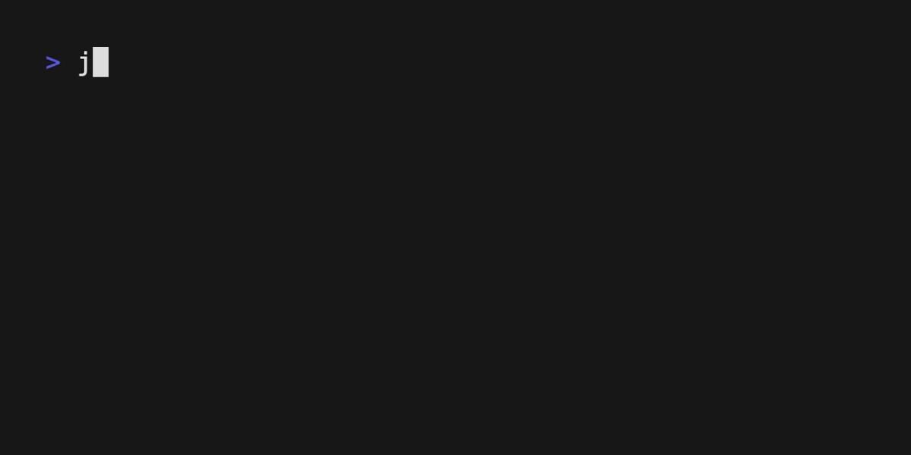

# jyy-amfam-toolkit

Personal CLI for automating recurring dev workflow tasks (Jira, git, and
GitLab) that I use at work.

Example:



## Prerequisites

- Python >= 3.13
- [uv](https://docs.astral.sh/uv/) installed
- `git` available on your PATH
- An Atlassian Cloud account with an API token
  ([create one here](https://id.atlassian.com/manage-profile/security/api-tokens))
- (Optional, for `glab` commands) A GitLab account with a personal access
  token with `api` scope
  ([create one here](https://gitlab.com/-/user_settings/personal_access_tokens))

## Setup

1. Clone the repo and install dependencies:

   ```bash
   uv sync
   ```

2. Copy the example env file to `~/.config/jyy-amfam-toolkit/.env` and fill
   in your credentials:

   ```bash
   mkdir -p ~/.config/jyy-amfam-toolkit
   cp .env.example ~/.config/jyy-amfam-toolkit/.env
   ```

   Edit `~/.config/jyy-amfam-toolkit/.env`:

   ```env
   JIRA_URL=https://amfament.atlassian.net
   JIRA_EMAIL=your.email@amfam.com
   JIRA_API_TOKEN=your-api-token-here

   # Optional, only needed for `glab` commands
   GITLAB_URL=https://gitlab.com
   GITLAB_TOKEN=your-gitlab-token-here
   ```

   This fixed location (rather than a `.env` in the project directory) is
   used so the CLI works the same regardless of which directory you run it
   from after a global install. This file is outside the repo and never
   committed.

## Optional: install globally

To run the CLI without prefixing `uv run` every time and from any directory:

```bash
uv tool install --editable .
```

Then use it directly:

```bash
jyy-amfam-toolkit branch
```

## Usage

Run commands via `uv run`:

```bash
uv run jyy-amfam-toolkit --help
```

### `branch` — create a git branch from a Jira ticket

Must be run from inside a git repository.

```bash
uv run jyy-amfam-toolkit branch
```

This will:

1. Fetch your Jira tickets (with jql filter set in code)
2. Prompt you to select a ticket.
3. Prompt you to select a [conventional branch](https://conventional-branch.github.io/)
   type (`feat`, `fix`, `chore`, `docs`, `style`, `refactor`, `test`, `build`,
   `ci`, `perf`).
4. Suggest a slug based on the ticket summary (editable).
5. Create and check out a branch named `{type}/{TICKET-KEY}-{slug}`
   (e.g. `feat/EITDC-7022-my-description`).

If the branch already exists locally, you'll be prompted to check it out
instead of erroring.

### `jira open` — open a Jira ticket in the browser

```bash
uv run jyy-amfam-toolkit jira open
```

Fetches your Jira tickets (assigned to you, excluding Done/Cancelled),
prompts you to select one, and opens it in your default browser.

Use `--branch` to skip the prompt and open the ticket referenced by the
current git branch name instead (e.g. `feat/EITDC-7022-my-slug` opens
`EITDC-7022`). Must be run from inside a git repository:

```bash
uv run jyy-amfam-toolkit jira open --branch
```

### `repo open` — open the current repository's remote page in the browser

Must be run from inside a git repository.

```bash
uv run jyy-amfam-toolkit repo open
```

Resolves the `origin` remote (works for GitHub, GitLab, Bitbucket, or any
other git host) and opens it in your default browser. Use `--remote` to
target a different remote name:

```bash
uv run jyy-amfam-toolkit repo open --remote upstream
```

### `glab mr open` — open the GitLab MR for the current branch in the browser

Must be run from inside a git repository with a GitLab remote, and
requires `GITLAB_TOKEN` to be configured.

```bash
uv run jyy-amfam-toolkit glab mr open
```

Looks up merge requests for the current branch. If exactly one is found,
opens it directly. If multiple exist (e.g. against different target
branches), prompts you to choose which one to open.

### `glab mr create` — create GitLab merge request(s) from the current branch

Must be run from inside a git repository with a GitLab remote, and
requires `GITLAB_TOKEN` to be configured.

```bash
uv run jyy-amfam-toolkit glab mr create
```

This will:

1. Push the current branch if it hasn't been pushed yet (with confirmation).
2. Fetch the project's branches from GitLab and prompt you to select one or
   more target branches (the project's default branch is pre-selected).
3. Build an MR title from the Jira ticket referenced in the branch name (if
   any), falling back to a manual prompt otherwise.
4. Use an existing `.gitlab/merge_request_templates/*.md` or
   `.gitlab/merge_request_template.md` for the description if present
   (prompting you to choose if multiple named templates exist); otherwise
   generates a minimal description with a Jira ticket link.
5. Create an MR against each selected target branch, printing the created
   MR URL(s).
6. Prompt to open the created MR(s) in your browser.

MRs are created as **drafts** by default (title prefixed with `Draft: `).
Use `--ready` to create a ready-for-review MR instead:

```bash
uv run jyy-amfam-toolkit glab mr create --ready
```

## Development

Make sure to have `pre-commit`. Add `pre-commit` hook:

```bash
pre-commit install
```

This runs `ruff` lint and format checks on git commits.

For unit testing, run:

```bash
uv run pytest
```
